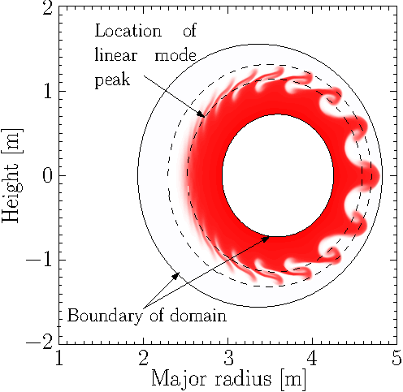
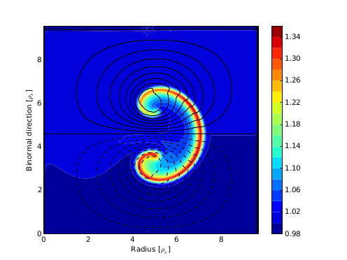
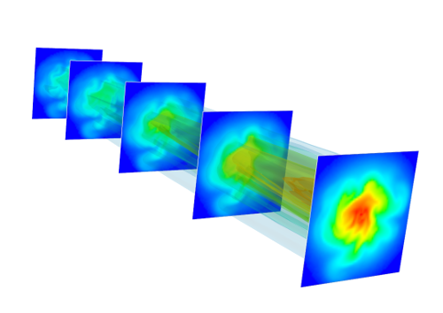
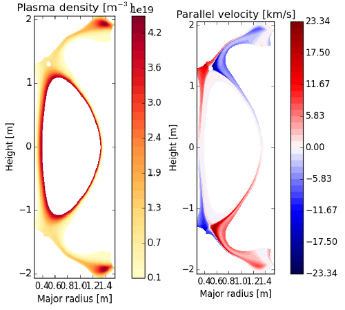
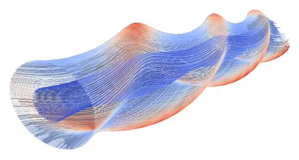

This page lists some of the applications for which BOUT++ is being used,
and some of the people involved. Most of the code for these is publicly available
and can be used as a starting point for new research projects.

If you would like your project listed here,
please contact [Peter Hill](mailto:peter.hill@york.ac.uk) or other BOUT++ developer.

#### Edge Localised Modes (ELMs)

[ELMs](https://doi.org/10.1088/0741-3335/38/2/001) are instabilities driven by pressure gradients and currents
at the edge of high performance tokamak plasmas. They result in repetitive bursts which could result in large
heat heat loads on the walls of large tokamaks, and so are a concern for [ITER](http://www.iter.org/).

The [elm-pb model](https://github.com/boutproject/BOUT-dev/tree/master/examples/elm-pb) included in the BOUT++ repository
solves a 4-field model for pressure, vorticity, the parallel component of the plasma velocity and electromagnetic potential.
It has been used for studies of ELM eruptions, mainly in circular geometry plasmas.

{:style="float: right;"}

#### Plasma filaments in 2D (blobs)

At the edge of tokamak (and other) plasmas, isolated "blobs" of plasma are often observed,
typically moving outwards at a few hundred meters per second. These blobs are elongated along the magnetic
field, forming long filaments. These single filaments have a surprisingly complicated range of nonlinear
behaviour.

The [blob2d model](https://github.com/boutproject/BOUT-dev/tree/master/examples/blob2d) simulates isothermal
blobs with a sheath closure, and includes example inputs to get started. This is quite a good place to start
learning how to use BOUT++ with a "real" physics model.

{:style="float: right;"}

#### Plasma turbulence in linear devices

The [Hermes model](https://github.com/boutproject/hermes) is being developed to study the interaction
between relatively small-scale turbulence and large-scale features, in particular the neutral gas and fuelling
of the plasma. 

{:style="float: right;"}

#### Turbulence and transport in tokamaks

The [Hermes model](https://github.com/boutproject/hermes) combines transport and turbulence in one self-consistent model.
It is under development, but includes electric fields and drifts, neoclassical transport, neutral gas interactions, and
instabilities including ballooning modes and resistive drift waves which lead to turbulent transport. It can be run
in a "transport" mode in 2D (axisymmetric) geometry with specified cross-field diffusion coefficients, or in 3D
with cross-field transport determined by the turbulence.

{:style="float: right;"}

#### Simulation of 3D geometries

Stellarator devices like [Wendelstein 7-X](http://www.ipp.mpg.de/w7x) confine plasmas in a twisted 3D magnetic field,
whose shape makes modelling more challenging than in tokamaks. Addressing this is an area of active development for BOUT++,
mainly using the Flux Coordinate Independent (FCI) approach.

{:style="float: right;"}

