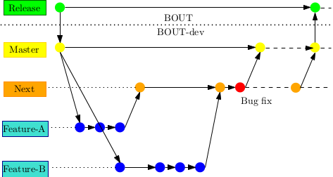

### Contributing to BOUT++

If you would like to help contribute to BOUT++ then there are many things
you can do which will make a difference. There are projects large and small 
which a student or researcher could use to get started with BOUT++ and
get more familiar with the code. You don't need to be particularly familar
with BOUT++ or C++ to work on many of these.

Some outstanding issues are listed below, divided into problems suitable for
beginners; those which need some familiarity with the code; and those
which may come under the heading of ongoing research. As these issues are fixed
they can be added to the [changes](changes.html) page, along with suitable attribution.

### Core library vs. Physics models / examples

BOUT++ is divided into a number of components, broadly divided into:

1. A core library, with source code under *src*
2. Examples, test cases, and physics models, some of which are under *examples*
3. Tools for pre- and post-processing

The [BOUT-dev](https://github.com/boutproject/BOUT-dev) repository should only contain code which is useful for a wide
range of users, and should **never** contain large binary files: It should rarely be necessary
to add anything over 1Mb, and never any file over 10Mb in size. Larger physics models, test cases, 
and tools should be stored in separate repositories. These can be created on the [boutproject](https://github.com/boutproject/)
page by the maintainers.

To work with separate repositories, you just need to specify where the BOUT++ directory is.
For example, 

    git clone git@github.com:boutproject/BOUT-dev.git
    git clone git@github.com:boutproject/examples.git

This creates two directories:

* **BOUT-dev**, which contains the BOUT++ library
* **examples**, which contains a set of physics model examples, but no library code

After compiling BOUT++, the examples can now be compiled. For example:

    cd examples/6field-simple
    make BOUT_TOP=../../BOUT-dev

The `BOUT_TOP` setting specifies where to find the BOUT++ directory containing a `make.config` file.
This allows users to develop their own models and applications independently, whilst keeping up to date
with changes to the core library.

### Development workflow using Git

Some useful discussion of working with git branches, on which this is based, are
[here](http://www.mail-archive.com/fenics@lists.launchpad.net/msg01396.html), 
[here](http://nvie.com/posts/a-successful-git-branching-model/) and [here](https://www.atlassian.com/git/workflows#!workflow-gitflow). The system adopted by BOUT++ is essentially the same as that used by
PETSc, a summary of which can be found here:

* [Developer instructions for PETsc](https://bitbucket.org/petsc/petsc/wiki/developer-instructions-git)
* [Quick summary of Git commands for PETSc developers](https://bitbucket.org/petsc/petsc/wiki/quick-dev-git)

The BOUT++ work flow uses three branches: **release**, **master**, and **next**.

**release** is stored in the [BOUT](https://github.com/boutproject/BOUT) repository 

**master** is stored in [BOUT-dev](https://github.com/boutproject/BOUT-dev), and
represents the latest working version. New feature development should start from this branch.

**next** is stored in [BOUT-dev](https://github.com/boutproject/BOUT-dev), and is a
testing branch where features are first merged for testing in combination. Once they
have been tested, features can be merged into master, and eventually into release. 

The work flow is illustrated below. New features start from **master** until they are 
considered complete. They are then merged into **next**, tested, fixed if needed, then merged into **master**.

A typical work flow to create a new feature or bug fix would follow these steps:

1. Create a new branch
2. (Optional) Push it to github to share and for backup
3. Make changes, commits
4. Submit a pull request into **next** using github's [Pull Requests](https://github.com/boutproject/BOUT-dev/pulls) system

#### Creating a feature branch

First get a copy of the [BOUT-dev](https://github.com/boutproject/BOUT-dev) repository (or git pull to update an existing copy):

    git clone git@github.com:boutproject/BOUT-dev.git
    cd BOUT-dev

Create a new branch **myfeature**, branching from **master**. Choose a descriptive name for
**myfeature**, anything except "master" or "next". 

    git checkout master
    git pull
    git checkout -b myfeature     ## Switched to a new branch "myfeature"

#### Pushing to github

If you want to push your branch to BOUT-dev to share with other developers, run:

    git push -u origin myfeature

This command pushes **myfeature** to the central BOUT-dev repository (origin), 
and the -u flag adds it as a remote tracking branch. 
After setting up the tracking branch, you can call "git push" without any parameters to
push updates to **myfeature**.

If another developer wants to try out this branch, they should clone the BOUT-dev repository
(or update an existing one), then run

    git checkout -b myfeature origin/myfeature

*Note* If you do not have write access to the BOUT-dev repository, you can develop in your
own fork and then send a pull request to someone with write access.

#### Making changes, commits

Now you would make changes, commit changes and push as usual:

    ... make changes ...
    git add <files>
    git commit
    git push   # Pushes to origin/myfeature

You can switch between branches using *checkout*:

    git checkout master    # Switch to "master"
    git checkout myfeature # Switch to "myfeature"

#### Merging into **next**

Once your feature is complete, ask other developers to have a look by creating a 
[Pull Request](https://github.com/boutproject/BOUT-dev/pulls) on the 
[BOUT-dev](https://github.com/boutproject/BOUT-dev) page. Once it is agreed
that the feature can be merged (or no-one objects within a few days), merge 
your feature into **next**

    git checkout next
    git merge --no-ff myfeature
    git push

Note the *--no-ff* option to merge. This ensures that your feature appears as a single commit in
the **next** branch, and makes it easier to see where individual features begin and end.

#### Releasing into **master**

At this point developers can make sure that **next** still passes the test suite, 
and that no nasty side-effects have been occurred. If the changes in next are relatively trivial
and unlikely to conflict (e.g. changes to the manual, standalone tools) then they can be moved into 
**master** almost immediately. In general though a separate 
[Pull Request](https://github.com/boutproject/BOUT-dev/pulls) should be created to merge into master.
The timing of this will depend on what features are under development which might conflict, but by default
this will occur every month. Once it is agreed that **master** should be updated, the maintainer
(currently B.Dudson) will merge changes into **master**.

To see what changes will be introduced by **next**, use git log:

    git log master..next

### Issues

#### Beginner

* Finding errors and inconsistencies in the user manual. As you're learning to use the code,
  note which parts of the manual are incorrect or incomplete. Once you figure out 
  (or are told) the solution to your problem, you could write it up in the manual.
  The coordinates manual also contains many derivations and useful identities, some of which
  are probably incorrect. If you find errors or derive additional useful quantities,
  please update the manual.
* Python routines for post-processing. 
* Pre- and post-processing routines to couple to MDSplus or other external database. 
* Write a pre-processing code (in Python preferably) which finds the valid numbers of processors
  for a given mesh.

#### Intermediate

* Parallel input / output

#### Advanced

* Interface to the [Hypre](http://computation.llnl.gov/casc/linear_solvers/sls_hypre.html) library, including
  3D geometry, branch-cuts and twist-shift condition. This would allow solution to more general boundary-value problems
  arising from polarisation equations and preconditioning.
* Generalise the mesh so that the number of points in X and Y can vary between processors.
